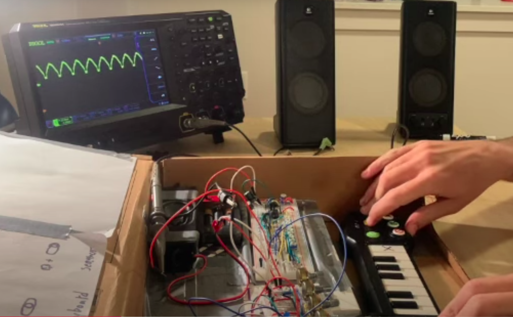

# synth

# What is it? 

Functionality demo (2 min):
https://www.youtube.com/watch?v=3Eg-PfTNHv8&t=4s

Longer demo & walk thru(10 minutes):
https://www.youtube.com/watch?v=Hvd5sonKdWs&t=5s

This synthesizer was a project for an Embedded Systems course in grad school. It's an ESP-32 Wrover microcontroller, and I used ArduinoIDE to flash code to it. There's more information in `/SupportingDocs` but briefly:

## Microcontroller 'brains'

ESP-32 Wrover hardware. Wasn't too intentional in my choice of hardware, this is just something I had lying around as I started this project. Started off with a raspberry Pi, but just naively using the IO pins a raspberry pi can only do digital read/writes, so pretty quickly hit a wall where all I could make was a square wave. Switching to the Wrover (with ArduinoIDE ot flash code to it) was able to pretty quickly start making sine and saw-shaped waves, and if you were to go further with a project like this the analog write could allow you basic ADSR control (I think).

### code

See `/code` directory for the literal code. 

`keyboard.ino` is 300 lines, and basically an object-oriented strategy where your 5 potentiometers give analog signals to the microcontroller, which then on a keypress makes a sound as a blocking operation where the playNote() function has taken those potentiometer readings as arguments. So your keypress can vary in duration, random noise added, pitch shift, and direction of pitch shift. This all worked pretty decently--though it has to be said that an 'object-oriented synthesizer' is a pretty disgusting phrase & makes me throw up in my mouth each time I say it. 

`drone.ino` is 500-ish lines, and a bit more ambitious, uses threading (very cool, makes me feel much better about myself & how cool I am) but doesn't work nearly as well. I have a droneNote() function which basically always makes a sound in a loop, but listens for potentiometer analog reads and varies the sound generation loop based on those values. This is my attempt to kind of 'actually make a synth', and I was able to get something like an LFO by using two potentiometers to vary the frequency and pitch shift of an LFO-like shift. But as you can hear in the demo video, this never sounded very good. My armchair diagnosis is that threading is doing things to my timing in ways I don't have control over or visibility into, and since timing=pitch that's turning everything to dogshit. But there's probably other stuff going wrong too, I'm new to C++ as well as threading. 

## Sequencer

Though I didn't literally follow any specifications from the world of eurorack, I did take modularity seriously in this project, and kinda built out units as I went with a thought that any of them could potentially interface with other components. This sequencer was the most successful instance of that, and I was even able to get it to work as a CV input for an existing synth:

My sequencer + Behingering Cat (1 min):
https://www.youtube.com/watch?v=H5DJ5-TVORI

Followed an 11/10 incredibly well made youtube tutorial for this part of the project: https://www.youtube.com/watch?v=vHNQQ6yUGyo&t=1008s. Only difference is I made mine 8-step instead of in the video he makes a 5-step sequencer. Same chips, was able to order on amazon pretty easy. 

## Keyboard

Reverse-engineered a toy keyboard to basically be an array of buttons which can control pitch( see `/SupportingDocs/photos` for photos of keyboard taking apart). They keyboard itself came from a toy from goodwill I took apart. It had an 8-wire ribbon connecting it to a cheap microcontroller which I didn't have access to (buried under some sort of plastic something), but basically I just hooked the 8 wires up to IO pins and experimented until I found a makeshift reverse-engineering of the keyboard where the logic as far as I can tell is just a simple matrix, where each keypress connects at least one circuit and by just sending three digital write signals and then reading back 5 read signals on the other wires (with some resistors in place to be careful and protect my IO pins on read, though I don't know how helpful that was), I was able to construct dictionarys that them mapped to known key presses. Never got it working 100%, buggy till the end, but a fun exercise. 
